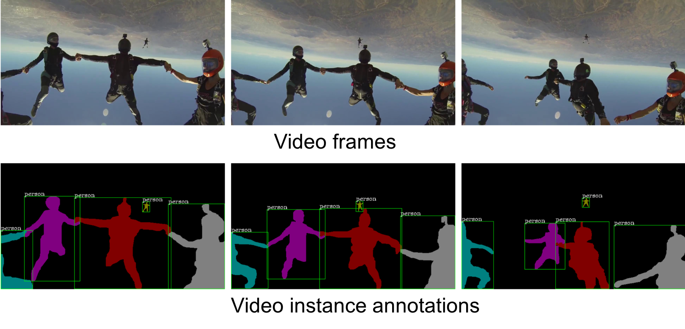
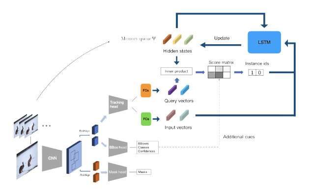

# Tracking Algorithm using Sequentially Updated Features (TASUF)
<table>
  <tr>
    <th scope="row">Baseline Model</th>
    <td ><center> </center></td>
    <td ><center> </center></td>
    <td ><center> </center></td>
  </tr>
  <tr>
    <th scope="row">Our Model</th>
    <td ><center> </center></td>
    <td ><center> </center></td>
    <td ><center> </center></td>
  </tr>
</table>

## Introduction
Details on this work can be found in this [paper](https://drive.google.com/file/d/1yjkmYV6KcsS7O5pgsjNckMWmyKdLdosY/view?usp=sharing).
  
In this work, we performed a research to enhance the baseline model (MaskTrackRCNN) for Video Instance Segmentation (VIS) task. VIS extends the instance segmentation task from the image domain to the video domain. The problem aims at **simultaneous detection, segmentation and tracking** of object instances in videos.
YouTubeVIS, a new dataset tailored for this task is collected based on the current largest video object segmentation dataset [YouTubeVOS](youtube-vos.org). Sample annotations of a video clip can be seen below.

We proposed a model for VIS, called TASUF (Tracking Algorithm using Sequentially Updated Features), which is an improved version of MaskTrackRCNN with enhanced tracking algorithm. The distinction of our model in the tracking algorithm is an utilization of LSTM to equalize the way of train and inference. In contrast to MaskTrackRCNN, TASUF sequentially updates the features of previously detected objects through a video. An overview of the algorithm is shown below.

## Installation
This repo is built based on [mmdetection](https://github.com/open-mmlab/mmdetection) commit hash `f3a939f`. Please refer to [INSTALL.md](INSTALL.md) to install the library.
You also need to install a customized [COCO API](https://github.com/youtubevos/cocoapi) for YouTubeVIS dataset.
You can use following commands to create conda env with all dependencies.
```
conda create -n MaskTrackRCNN -y
conda activate MaskTrackRCNN
conda install -c pytorch pytorch=0.4.1 torchvision cuda92 -y
conda install -c conda-forge cudatoolkit-dev=9.2 opencv -y
conda install cython -y
pip install git+https://github.com/youtubevos/cocoapi.git#"egg=pycocotools&subdirectory=PythonAPI"
bash compile.sh
pip install .
```
You may also need to follow [#1](/../../issues/1) to load MSCOCO pretrained models.
## Model training and evaluation
Our model is based on MaskRCNN-resnet50-FPN. The model is trained end-to-end on YouTubeVIS based on a MSCOCO pretrained checkpoint ([link](https://s3.ap-northeast-2.amazonaws.com/open-mmlab/mmdetection/models/mask_rcnn_r50_fpn_1x_20181010-069fa190.pth)).
### Training
1. Download YouTubeVIS from [here](https://youtube-vos.org/dataset/vis/).
2. Symlink the train/validation dataset to `$MMDETECTION/data` folder. Put COCO-style annotations under `$MMDETECTION/data/annotations`.
```
mmdetection
├── mmdet
├── tools
├── configs
├── data
│   ├── train
│   ├── val
│   ├── annotations
│   │   ├── instances_train_sub.json
│   │   ├── instances_val_sub.json
```

3. Run `python3 tools/train.py configs/masktrack_rcnn_r50_fpn_1x_youtubevos_suf.py` to train the model.
For reference to arguments such as learning rate and model parameters, please refer to `configs/masktrack_rcnn_r50_fpn_1x_youtubevos_suf.py`

### Evaluation
Our pretrained model is available for download at [Google Drive](https://drive.google.com/file/d/10bsjO-WP2GAWQC7uPP6Gk0n2rUYLexfn/view?usp=sharing).
Run the following command to evaluate the model on YouTubeVIS.
```
python3 tools/test_video.py configs/masktrack_rcnn_r50_fpn_1x_youtubevos.py [MODEL_PATH] --out [OUTPUT_PATH] --eval segm
```
A json file containing the predicted result will be generated as `OUTPUT_PATH.json`. YouTubeVIS currently only allows evaluation on the codalab server. Please upload the generated result to [codalab server](https://competitions.codalab.org/competitions/20128) to see actual performances.

## License
This project is released under the [Apache 2.0 license](LICENSE).

## Contact
If you have any questions regarding the repo, please contact Linjie Yang (yljatthu@gmail.com) or create an issue.

## Acknowledgements
We acquired huge benefits from the work done by [Linjie Yang *et al.*](https://arxiv.org/abs/1905.04804). The repo at this [link](https://github.com/youtubevos/MaskTrackRCNN) serves as the official code release of the MaskTrackRCNN model for Video Instance Segmentation described in the tech report:
```
@article{ Yang2019vis,
  author = {Linjie Yang and Yuchen Fan and Ning Xu},  
  title = {Video instance segmentation},
  journal = {CoRR},
  volume = {abs/1905.04804},
  year = {2019},
  url = {https://arxiv.org/abs/1905.04804}
}
```
We appreciate their great achievements on Video Instance Segmentation (VIS) task.